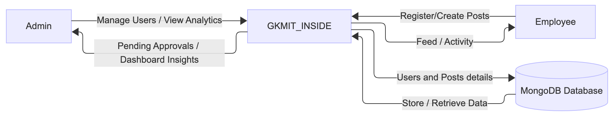

# **Level 0 — Context Diagram**

This diagram illustrates the **high-level data flow** between the two primary user roles — **Admin** and **Employee** — and the central system, **GKMIT_INSIDE**.  
It highlights how users interact with the platform for registration, posting, approvals, and content access, while the system handles data storage and processing via **MongoDB**.

---

<!-- impoting image of dfd level 0 -->

{ width="800" }

---

### Explanation

Employee can register, log in, and create posts that await admin approval. Admin oversees user and post approvals, manages analytics, and has all employee privileges.

**GKMIT_INSIDE** is the central application system that processes requests, manages workflows, and communicates with the database.
MongoDB Database stores all persistent data — including users, posts, comments, reactions, and bookmarks.

This diagram represents the Level 0 Context View, showing external entities and major data exchanges with the system as a single logical process.
